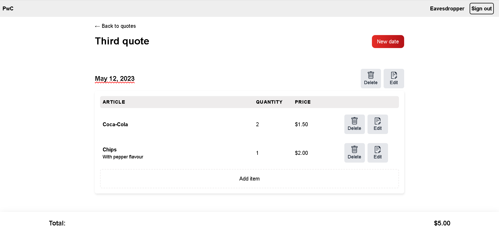

# Quote-Editor-Hotrails
With the quote editor, you can create, update and delete quotes. When clicking on a quote, you access the page to create, update and delete dates. On each date, you can add line items. Every time you create, update, or delete a line item, the quote total gets updated.

## Live Demo

N/A

## Screenshot

## Built With

- RoR
- Hotwire
- Tailwind CSS
- PostgreSQL
- Linters

## Getting Started

To get a local copy up and running follow these simple example steps.

### Prerequisites

- Laptop or Desktop
- Web Browser
- Ruby on Rails & PostgreSQL (installed and set up)
- IDE (preferably Visual Studio Code)
- Programming Knowledge

### Installation, Setup and Usage

- Clone this [repo](https://github.com/SaidRasinlic/Quote-Editor-Hotrails)
- Navigate to the correct directory `cd Quote-Editor-Hotrails` (case sensitive)
- Setup database configuration in [./app/config/database.yml](./config/database.yml) and use your correct username and password to access PostgreSQL database
- In your terminal run the following commands:
  - `bundle install`
  - `yarn install`
  - `rails tailwindcss:build`
  - `rails db:create`
  - `rails db:migrate`
- Run `rails s` to start your server
- Enter `http://localhost:3000/` or `localhost:3000` on your browser to run the app locally

**
Congratulations, app should run successfully 🎉!
**

## Author

👤 **Said Rasinlic**

- GitHub: [@GitHub/SaidRasinlic](https://github.com/SaidRasinlic)
- Twitter: [@Twitter/SaidRasinlic](https://twitter.com/SaidRasinlic)
- LinkedIn: [@LinkedIn/SaidRasinlic](https://www.linkedin.com/in/SaidRasinlic)

## 🤝 Contributing

Contributions, issues, and feature requests are welcome!

Feel free to check the [issues page](../../issues/).

## Show your support

Give a ⭐️ if you like this project!

## Acknowledgments

- S.R.

## 📝 License

This project is [MIT](LICENSE) licensed.
